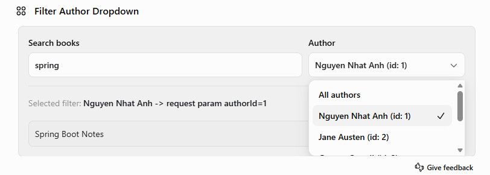
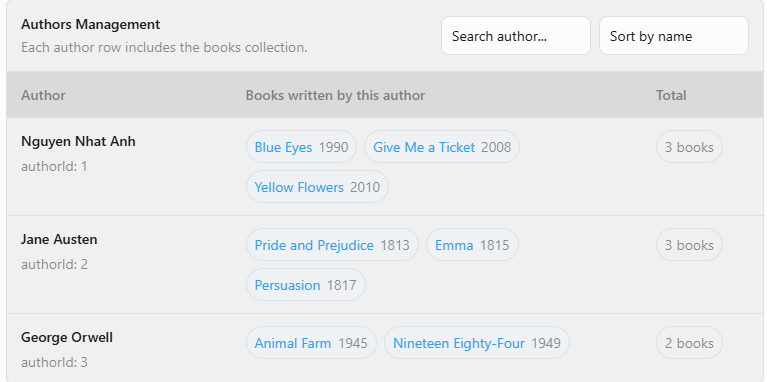

# Module 01: JOIN FETCH 

## Nội dung trình bày
- Tải danh sách Author một cách đơn giản mà không tải dữ liệu từ các associations.
- Problem N+1 khi sử dụng lazy loading.
- `JOIN FETCH` với quan hệ to-one.
- `JOIN FETCH` với một collection.
- `JOIN FETCH` với nhiều collection.
- Phân trang kết hợp với `JOIN FETCH`

## Mối quan hệ giữa Entity

```text
Country (1) ------ (*) Author
Author  (1) ------ (*) Book
Author  (1) ------ (*) Award
```
## Giả lập dữ liệu

```text
50 Country
500 Author
20 Book cho mỗi Author
10 Award cho mỗi Author
```

## Các thông số trong Response

```java
public record Response<T>(
        long ormQueryExecutionCount,
        List<String> ormQueries,
        long sqlStatementCount,
        List<String> sqlStatements,
        long estimatedDatabaseRows,
        double executionTimeMs,
        T result
) {}
```

Ý nghĩa của các chỉ số:

- `ormQueryExecutionCount`:  Số lượng ORM query mà Hibernate đã thực thi
- `ormQueries`:  Các lệnh ORM đã được chạy
- `sqlStatementCount`: số lượng câu lệnh SQL đã được chạy.
- `sqlStatements`: câu lệnh SQL đã chạy (giới hạn 20 câu lệnh đầu tiên)
- `estimatedDatabaseRows`: số dòng database trả về (ước tính)
- `executionTimeMs`: thời gian thực thi mỗi api.
- `result`: dữ liệu trả về của từng api (giới hạn 5 DTO đầu tiên)


Cấu trúc quan hệ hiện tại:

| Entity field | Mapping |
| --- | --- |
| `Author.country` | `@ManyToOne(fetch = FetchType.LAZY)` |
| `Author.books` | `@OneToMany(fetch = FetchType.LAZY)` |
| `Author.awards` | `@OneToMany(fetch = FetchType.LAZY)`|
| `Book.author` | `@ManyToOne(fetch = FetchType.LAZY)` |
| `Award.author` | `@ManyToOne(fetch = FetchType.LAZY)` |

## Tại sao các quan hệ thường được cấu hình LAZY
### Scenario 01: Chỉ tải Authors

Trên trang tìm kiếm sách, giao diện cần một danh sách Author dạng dropdown. Dropdown này chỉ cần hai trường:

| Field | Purpose |
| --- | --- |
| `author.id` | Dùng làm giá trị filter gửi đến backend |
| `author.name` | Được hiển thị làm label trong dropdown |



#### Demo endpoint: `GET /demos/authors`

Trong trường hợp này, giao diện không cần thông tin về Books, Awards hoặc Country của Author.

Nếu tải những quan hệ đó, backend sẽ phải truy vấn, ánh xạ và trả về những dữ liệu mà giao diện không sử dụng.

Đó là lý do các quan hệ như Author.books, Author.awards và Author.country thường được cấu hình là FetchType.LAZY.

Với LAZY loading, một repository method đơn giản như findAll() chỉ tải các dòng Author trước. Dữ liệu liên quan chỉ được tải sau khi ứng dụng thực sự truy cập đến nó.

| Metric | Value | Why it matters for later scenarios       |
| --- | ---: |------------------------------------------|
| `sqlStatementCount` | `1` |                                          |
| `estimatedDatabaseRows` | `500` | Đúng với số lượng Author trong database. |


### Scenario 02 - Vấn đề: Lazy Books gây ra N+1


Một trang quản trị hiển thị danh sách Author cùng với tất cả Books được viết bởi từng Author.



Response cần dữ liệu có dạng:

```text
[
  {
    "author": "Author 1",
    "books": ["Book 1", "Book 2", "Book 3"]
  },
  {
    "author": "Author 2",
    "books": ["Book 4", "Book 5", "Book 6"]
  }
]
  ```

Một cách triển khai đơn giản có thể tải toàn bộ Authors trước:

  ```

List<Author> authors = authorRepository.findAll();

  ```

Sau đó, truy cập collection Books đang được tải lazy: **author.getBooks()**
Do Author.books được cấu hình là FetchType.LAZY, Hibernate không tải Books cùng với Authors trong truy vấn đầu tiên.
```select * from books b where b.author_id = ?```

Do đó, luồng SQL trở thành:

1 query để tải toàn bộ Authors.
N query bổ sung để tải Books cho N Authors.

Với 500 Authors, tổng số câu SQL có thể là:
  ```1 + 500 = 501 SQL statements```

  | Metric                   |         Value | Meaning                                                                               |
| --- | --- | --- |
  | `ormQueryExecutionCount` |           `1` | Ứng dụng chỉ chủ động chạy một ORM query chính để tải Authors                           |
  | `sqlStatementCount`      |         `501` | 1 query tải Authors và 500 lazy query tải Books. for Books.   |
  | `estimatedDatabaseRows`  |      `10,500` | 500 Author rows + 10,000 Book rows.                                                   |


### Kịch bản 03 — Vấn đề: Lazy Country gây ra N+1
Bây giờ trang cần hiển thị Authors cùng với thông tin Country của họ.

Ví dụ, trang quản trị có thể hiển thị danh sách như sau:

| Author | Country | Region |
| --- | --- | --- |
| Author 1 | Country 1 | Continent Group 1 |
| Author 2 | Country 2 | Continent Group 2 |
| Author 3 | Country 3 | Continent Group 3 |
Response cần dữ liệu có dạng:

```text
[
  {
    "id": 1,
    "name": "Author 1",
    "country": {
      "id": 1,
      "name": "Country 1",
      "location": "Region 1",
      "region": "Continent Group 1"
    }
  },
  {
    "id": 2,
    "name": "Author 2",
    "country": {
      "id": 2,
      "name": "Country 2",
      "location": "Region 2",
      "region": "Continent Group 2"
    }
  }
]

  ```
Một cách triển khai đơn giản có thể tải toàn bộ Authors trước:

```
List<Author> authors = authorRepository.findAll();
  ```
Sau đó, chương trình truy cập quan hệ Country đang được tải lazy: **author.getCountry()**

Khi đó, Hibernate có thể thực thi câu SQL sau:
```
select c1_0.id,c1_0.location,c1_0.name,c1_0.region from countries c1_0 where c1_0.id=?
```
> 500 Authors chỉ tham chiếu đến 50 Country khác nhau. Hibernate tải mỗi Country một lần và tái sử dụng entity đó từ Persistence Context hiện tại. Vì vậy, request thực thi 1 query tải Authors và 50 query tải Countries.

ồng SQL trở thành:

1 query để tải toàn bộ Authors.
50 query bổ sung để tải 50 Country khác nhau được tham chiếu bởi các Authors.

Tổng số câu SQL có thể là:

```
1 + 50 = 51 SQL statements
```

#### Demo endpoint: GET /demos/authors/n-plus-one/country
| Metric | Value | Meaning |
| --- | --- | --- |
| ``ormQueryExecutionCount`` | 1 | Ứng dụng chỉ chủ động chạy một ORM query chính để tải Authors. |
| ``sqlStatementCount`` | 51 | 1 query tải Authors và 50 query tải Countries.|
| ``estimatedDatabaseRows`` | 500 |Số lượng dòng Author dự kiến trong database. |


## Apply JOIN FETCH
### Kịch bản 04 — Trường hợp an toàn: JOIN FETCH Country

Thay vì tải Authors trước rồi để Hibernate tải Countries sau, repository yêu cầu tải Authors và Countries trong cùng một query:

```java
select a
from Author a
join fetch a.country
order by a.id
```

Hibernate chuyển truy vấn này thành một câu SQL join giữa bảng `authors` và `countries`:

```sql
select
    a.id,
    a.name,
    a.country_id,
    c.id,
    c.name,
    c.location,
    c.region
from authors a
join countries c on c.id = a.country_id
order by a.id
```
| author_id | author_name | country_id | country_name |
|---:|---|---:|---|
| 1 | Author 1 | 1 | Country 1 |
| 2 | Author 2 | 1 | Country 1 |
| 3 | Author 3 | 2 | Country 2 |

Luồng SQL bây giờ trở thành:

- 1 câu SQL tải Authors và Countries cùng lúc.
- Không cần thêm lazy query để tải Country khi ánh xạ response.

JOIN FETCH với quan hệ to-one thường an toàn vì mỗi Author chỉ tham chiếu đến tối đa một Country. Việc join Country không làm một Author bị nhân thành nhiều dòng kết quả.
#### Demo endpoint: `GET /demos/authors/join-fetch/country`

| Metric | Value | Meaning |
| --- | ---: | --- |
| `ormQueryExecutionCount` | `1` | Một ORM query yêu cầu tải Authors cùng với Countries. |
| `sqlStatementCount` | `1` | Chỉ một câu SQL được chuẩn bị ở tầng JDBC. |
| `estimatedDatabaseRows` | `500` |Kết quả join trả về một dòng cho mỗi Author. |

### Scenario 05 - Trade-off: JOIN FETCH Books

```java
select distinct a
from Author a
join fetch a.books
order by a.id
```

Hibernate chuyển truy vấn này thành một câu SQL:

```sql
select distinct
    a.id,
    a.country_id,
    a.name,
    b.author_id,
    b.book_order,
    b.id,
    b.publish_year,
    b.title
from authors a
join books b on a.id = b.author_id
order by a.id
```

Luồng SQL được giảm từ:
```text
1 query để tải Authors
500 query để tải Books của từng Author
```

thành:

```text
1 query để tải Authors và Books cùng lúc
```

Điều này giải quyết vấn đề N+1:

```text
501 SQL statements → 1 SQL statement
```
Tuy nhiên, fetch một collection khác với fetch một quan hệ to-one như Author.country.
Mỗi Author có thể có nhiều Books, vì vậy database phải trả về một dòng join cho mỗi cặp Author–Book:


| author_id | author_name | book_id | book_title |
| --------: | ----------- | ------: | ---------- |
|         1 | Author 1    |       1 | Book 1     |
|         1 | Author 1    |       2 | Book 2     |
|         1 | Author 1    |       3 | Book 3     |
|         2 | Author 2    |       4 | Book 4     |
|         2 | Author 2    |       5 | Book 5     |
|         2 | Author 2    |       6 | Book 6     |
|         3 | Author 3    |       7 | Book 7     |
|         3 | Author 3    |       8 | Book 8     |
|         3 | Author 3    |       9 | Book 9     |

Với 500 Authors và 20 Books cho mỗi Author, kết quả join chứa:

```text
500 Authors × 20 Books = 10,000 joined rows
```

#### Demo endpoint: `GET /demos/authors/join-fetch/book`

| Metric | Value | Meaning |
| --- | ---: | --- |
| `ormQueryExecutionCount` | `1` | Một ORM query yêu cầu tải Authors cùng với Books. |
| `estimatedDatabaseRows` | `10,000` | database trả về một dòng cho mỗi cặp Author–Book. |
| `executionTimeMs` | `381.6906` | Time measured for this benchmark request. It can change between runs and environments. |

JOIN FETCH loại bỏ số lượng lớn lượt trao đổi (network latency) với database, nhưng đổi lại bằng một tập kết quả lớn hơn.

| Approach           | SQL statements | Estimated rows | Main cost                          | executionTimeMs |
|--------------------| ---: |---------------:|------------------------------------|-----------------|
| Lazy Books         | `501` |       `10,500` | Many database round trips          | `1274.3404`     |
| JOIN FETCH Books   | `1` |       `10,000` | One large joined result            | `381.6906`      |
| JOIN FETCH Country | `1` |          `500` | One small joined result |  `28.2585`      |


### Scenario 06 - Failure Case: Fetching Two List Bags

Trong kịch bản này, Author.reviews và Author.awards đều được ánh xạ dưới dạng các collection List thông thường:
```java
@OneToMany(
    mappedBy = "author",
    cascade = CascadeType.ALL,
    orphanRemoval = true,
    fetch = FetchType.LAZY
)
@Builder.Default
private List<Review> reviews = new ArrayList<>();

@OneToMany(
    mappedBy = "author",
    cascade = CascadeType.ALL,
    orphanRemoval = true,
    fetch = FetchType.LAZY
)
@Builder.Default
private List<Award> awards = new ArrayList<>();
```
Vì vậy, Hibernate xem cả hai collection này là bag. [Đọc định nghĩa về Bag](MultipleBagFetchException.md)

| Author | Review | Award |
| --- | --- | --- |
| Author 1 | Review 1 | Award 1 |
| Author 1 | Review 1 | Award 2 |
| Author 1 | Review 1 | Award 3 |
| Author 1 | Review 2 | Award 1 |
| Author 1 | Review 2 | Award 2 |
| Author 1 | Review 2 | Award 3 |
Cùng một Review xuất hiện lại một lần cho mỗi Award, và cùng một Award cũng xuất hiện lại một lần cho mỗi Review.

Do đó, Hibernate từ chối thực thi query thay vì xây dựng các collection có nguy cơ chứa dữ liệu không chính xác.

Trả lại lỗi exception:
```text
org.hibernate.loader.MultipleBagFetchException:
cannot simultaneously fetch multiple bags
```
### Scenario 07 - Risky Case: Multiple Collection JOIN FETCH Causes Row Explosion

Trong kịch bản này, chúng ta khắc phục vấn đề fetch hai bag bằng cách cấu hình books thành một List có chỉ số vị trí thông qua @OrderColumn.

Repository bây giờ fetch cả hai collection:

```java
select distinct a
from Author a
join fetch a.books
join fetch a.awards
order by a.id
```

Hibernate tạo một câu SQL join cả ba bảng:

```sql
select distinct
    a.id,
    a.name,
    b.id,
    b.title,
    b.publish_year,
    aw.id,
    aw.name
from authors a
join books b on a.id = b.author_id
join awards aw on a.id = aw.author_id
order by a.id
```
#### Demo endpoint: `GET /demo/author/join-fetch/book-and-award`

| author_id | author_name | book_id | book_title | award_id | award_name |
| --------: | ----------- | ------: | ---------- | -------: | ---------- |
|         1 | Author 1    |       1 | Book 1     |        1 | Award 1    |
|         1 | Author 1    |       1 | Book 1     |        2 | Award 2    |
|         1 | Author 1    |       1 | Book 1     |        3 | Award 3    |
|         1 | Author 1    |       2 | Book 2     |        1 | Award 1    |
|         1 | Author 1    |       2 | Book 2     |        2 | Award 2    |
|         1 | Author 1    |       2 | Book 2     |        3 | Award 3    |

Query được thực thi thành công, nhưng nó tạo ra một tập kết quả SQL lớn hơn rất nhiều so với những gì response Java cuối cùng thể hiện:
```text
500 Authors × 20 Books × 10 Awards
= 100,000 joined rows
```
Hibernate phải đọc toàn bộ 100.000 dòng SQL, sau đó xây dựng lại thành khoảng:
```text
500 unique Author entities
10,000 unique Book entities
5,000 unique Award entities
```

| Metric | Value | Meaning                                                                     |
| --- | ---: |-----------------------------------------------------------------------------|
| `ormQueryExecutionCount` | `1` | Một ORM query yêu cầu tải Authors, Books và Awards.                         |
| `sqlStatementCount` | `1` | Hibernate thực thi một câu SQL có join.                                     |
| `estimatedDatabaseRows` | `100,000` | Mỗi Book được kết hợp với mỗi Award thuộc cùng một Author.                  |
| `executionTimeMs` | `1567.3461` | Thời gian thực thi dài vì phải load lượng lớn Result Set và dựng lại Entity |


| Approach | SQL statements | Estimated database rows | Measured execution time |
| --- | ---: | ---: | ---: |
| N+1 for Books and Awards | `1,001` | `15,500` | `842.7453 ms` |
| JOIN FETCH Books and Awards | `1` | `100,000` | `1567.3461 ms` |
Trong một số trường hợp, cách join nhiều collection này còn có thời gian thực thi lâu hơn so với N+1 (tuy nhiên không phải trường hợp nào cũng đúng)

## JOIN FETCH With Pagination

### Scenario 08 - Safe Pagination: JOIN FETCH Country
Spring Data áp dụng phân trang vào query và thực thi câu SQL tương tự như sau:
```sql
select
    a.id,
    a.name,
    c.id,
    c.name,
    c.location,
    c.region
from authors a
join countries c on c.id = a.country_id
order by a.id
offset 0 rows
fetch first 10 rows only
```
database áp dụng phân trang trực tiếp và chỉ trả về 10 Authors đầu tiên cùng với Countries của họ.

- Country được tải trong cùng data query.
- Phép join to-one không làm tăng số dòng của mỗi Author.

| Metric | Value | Meaning |
| --- | ---: | --- |
| `ormQueryExecutionCount` | `2` |Một ORM query tải dữ liệu của trang và một query đếm tổng số Authors. |
| `estimatedDatabaseRows` | `10` | Data query trả về khoảng một dòng cho mỗi Author trong trang. |

Phân trang với JOIN FETCH cho quan hệ to-one là một cách sử dụng an toàn và được khuyến nghị.

### Scenario 09 - Risky Pagination: JOIN FETCH Books
Trong ví dụ này, thuộc tính sau phải được tắt để đảm bảo API không bị chặn:
```properties
hibernate.query.fail_on_pagination_over_collection_fetch=false
```

Sau đó, repository cố gắng tải Authors cùng với Books bằng query:

```java
select distinct a
from Author a
join fetch a.books
order by a.id
```

Hibernate tạo data query sau:

```sql
select distinct
    a.id,
    a.country_id,
    a.name,
    b.author_id,
    b.book_order,
    b.id,
    b.publish_year,
    b.title
from authors a
join books b on a.id = b.author_id
order by a.id
```

Câu SQL này không chứa:
```sql
offset 0 rows
fetch first 10 rows only
```

| Metric | Value | Meaning                                                                                       |
| --- | ---: |-----------------------------------------------------------------------------------------------|
| `ormQueryExecutionCount` | `2` | Một ORM query tải Authors cùng với Books và một query đếm tổng số Authors.                      |
| `estimatedDatabaseRows` | `10,000` | database trả về toàn bộ 500 × 20 cặp Author–Book, thay vì 200 dòng tương ứng với 10 Authors. |

Vì vậy, database không chỉ trả về 10 Authors được yêu cầu bởi page. Thay vào đó, nó trả về toàn bộ kết quả join giữa Author và Book (10,000 dòng).

Hibernate cảnh báo về hành vi này bằng thông báo:
```text
HHH90003004:
firstResult/maxResults specified with collection fetch;
applying in memory
``` 
Cảnh báo này có nghĩa là Hibernate áp dụng phân trang lên kết quả Author trong bộ nhớ JVM sau khi đã tải toàn bộ kết quả join từ database.

#### Vì sao không thể áp dụng phân trang SQL một cách an toàn?
Join với collection tạo ra nhiều dòng cho cùng một Author:

| author_id | author_name | book_id | book_title |
| --------: | ----------- | ------: | ---------- |
|         1 | Author 1    |       1 | Book 1     |
|         1 | Author 1    |       2 | Book 2     |
|         1 | Author 1    |       3 | Book 3     |
|         2 | Author 2    |       4 | Book 4     |
|         2 | Author 2    |       5 | Book 5     |
|         2 | Author 2    |       6 | Book 6     |
|         3 | Author 3    |       7 | Book 7     |
|         3 | Author 3    |       8 | Book 8     |
|         3 | Author 3    |       9 | Book 9     |

Nếu database giới hạn kết quả ở 10 dòng join, nó có thể chỉ trả về một Author cùng với 10 trong tổng số 20 Books của Author đó:
```text
10 joined rows ≠ 10 complete Authors
```

Để đảm bảo các collection được tải đầy đủ, Hibernate thực hiện quy trình sau:
```text
database trả về toàn bộ dòng join
→ Hibernate xây dựng lại Authors và Books
→ Hibernate loại bỏ các Author trùng lặp
→ Hibernate chọn 10 Authors trong bộ nhớ JVM
```

Page cuối cùng chỉ chứa 10 Authors, nhưng trước đó Hibernate đã phải tải và xử lý toàn bộ 500 Authors cùng với 10.000 Books rồi mới áp dụng phân trang trong bộ nhớ JVM.

### Scenario 10 - Failure: Manual Pagination Over Joined Rows
```sql
select a.*
from authors a
join books b on b.author_id = a.id
order by a.id
limit :limit offset :offset
```
JPQL chặn việc sử dụng biến limit và offset để phân trang nên không thực thi được, chỉ có thể ứng dụng limit & offset trong tầng SQL.
#### Demo endpoint

```text
GET /demo/author/self-defined/pagination/book?page=0&size=10&queryType=SQL
```
Phần dữ liệu xem trước trong response đã cho thấy kết quả không chính xác:

```json
[
  {
    "id": 1,
    "name": "Author 1",
    "books": ["20 Books"]
  },
  {
    "id": 1,
    "name": "Author 1",
    "books": ["20 Books"]
  },
  {
    "id": 1,
    "name": "Author 1",
    "books": ["20 Books"]
  },
  {
    "id": 1,
    "name": "Author 1",
    "books": ["20 Books"]
  },
  {
    "id": 1,
    "name": "Author 1",
    "books": ["20 Books"]
  }
]
```
Về mặt kỹ thuật, query trả về đúng 10 dòng. Tuy nhiên, 10 dòng đó không đại diện cho 10 Authors.
Chính response đã chứng minh rằng tự thêm LIMIT và OFFSET không giải quyết được bài toán phân trang khi join với collection:
```text
Expected IDs: [1, 2, 3, ..., 10]
Actual IDs:   [1, 1, 1, ..., 1]
```

Query đang giới hạn số dòng SQL, không phải số lượng root Author:
```text
LIMIT 10 dòng join ≠ 10 Authors
Collection Books đầy đủ ≠ Page Authors chính xác
Phân trang ở cơ sở dữ liệu ≠ Phân trang root entity chính xác
```
# Kết luận:
| Kiểu tải dữ liệu              | Kết luận                                                                            |
| ----------------------------- | ----------------------------------------------------------------------------------- |
| Quan hệ to-one                | **Thường an toàn và được khuyến nghị sử dụng**                                      |
| Một collection to-many        | **Nhạy cảm với kích thước dữ liệu — cần benchmark trước khi sử dụng**               |
| Nhiều collection to-many      | **Có nguy cơ tạo Cartesian product — nên ưu tiên tải bằng các truy vấn riêng biệt** |
| Quan hệ to-one có phân trang  | **Thường an toàn**                                                                  |
| Quan hệ to-many có phân trang | **Nên sử dụng phân trang hai bước**                                                 |
