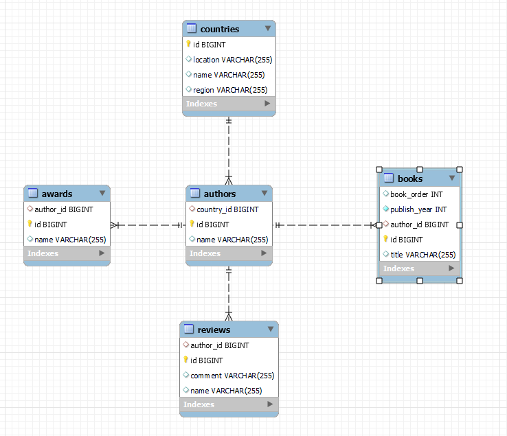
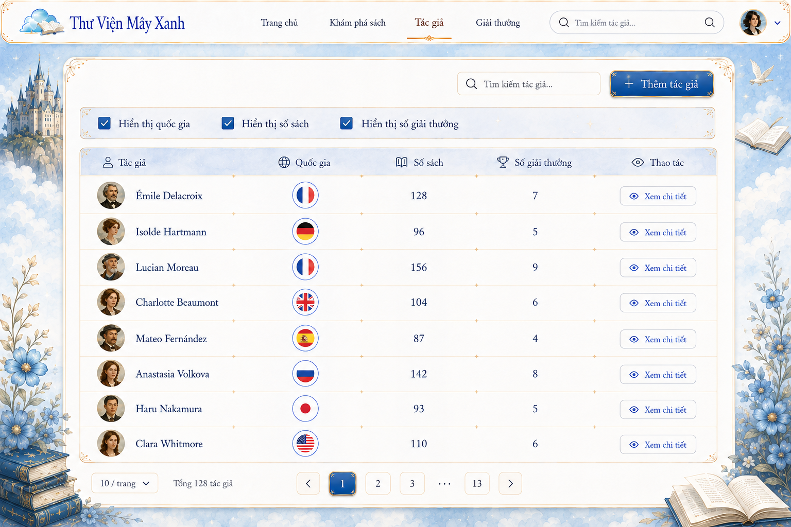
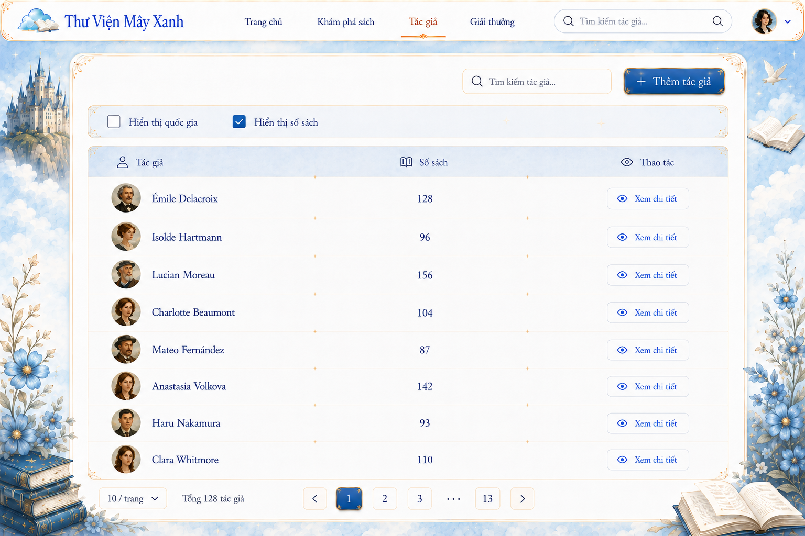
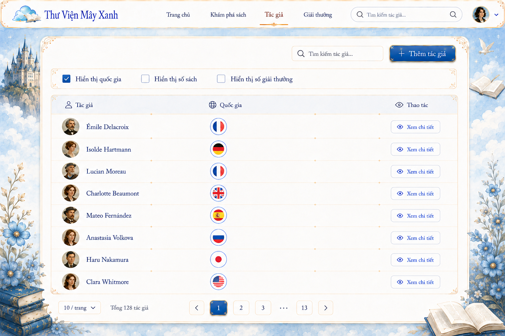
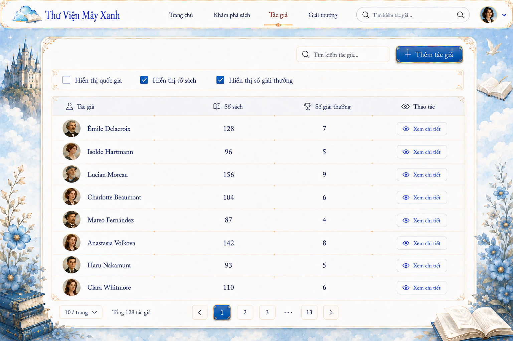

# Chủ đề 1: Sử dụng Join Fetch để giải quyết vấn đề N+1

## Nội dung trình bày

- [1. Giới thiệu hệ thống](#1-giới-thiệu-hệ-thống)
    - [1.1. Mô hình dữ liệu](#11-mô-hình-dữ-liệu)
    - [1.2. Dataset](#12-dataset)
    - [1.3. Các chức năng minh họa](#13-các-chức-năng-minh-họa)
    - [1.4. Vì sao các association được cấu hình LAZY?](#14-vì-sao-các-association-được-cấu-hình-lazy)

- [2. Các tình huống xảy ra N+1](#2-các-tình-huống-xảy-ra-n1)
    - [2.1. Tải danh sách tác giả và quốc gia](#21-tải-danh-sách-tác-giả-và-quốc-gia)
    - [2.2. Tải danh sách tác giả và sách](#22-tải-danh-sách-tác-giả-và-sách)
    - [2.3. Tải danh sách tác giả, sách và giải thưởng](#23-tải-danh-sách-tác-giả-sách-và-giải-thưởng)

- [3. Áp dụng JOIN FETCH](#3-áp-dụng-join-fetch)
    - [3.1. JOIN FETCH quan hệ to-one](#31-join-fetch-quan-hệ-to-one)
    - [3.2. JOIN FETCH một collection](#32-join-fetch-một-collection)
    - [3.3. JOIN FETCH to-one với pagination](#33-join-fetch-to-one-với-pagination)

- [4. Giới hạn của JOIN FETCH](#4-giới-hạn-của-join-fetch)
    - [4.1. MultipleBagFetchException](#41-multiplebagfetchexception)
    - [4.2. Cartesian product khi fetch nhiều collection](#42-cartesian-product-khi-fetch-nhiều-collection)
    - [4.3. Pagination với collection](#43-pagination-với-collection)

- [5. Kết luận](#5-kết-luận)

##  1. Giới thiệu hệ thống
Hệ thống quản lý sách trực tuyến cho phép người dùng tìm kiếm sách và xem thông tin về tác giả, quốc gia, tác phẩm và giải thưởng của họ.


### 1.1. Mô hình dữ liệu



### 1.2. Tập dữ liệu

```text
50 Countries
500 Authors
20 Books cho mỗi Author -> 10.000 Books
10 Awards cho mỗi Author -> 5.000 Awards
```
### 1.3. Các chức năng minh họa

Bốn use case được sử dụng trong bài trình bày:

1. **Lọc sách theo tác giả:** chỉ cần `Author.id` và `Author.name`.
2. 


2. **Danh sách tác giả**



### 1.4. FetchType: LAZY và EAGER
FetchType quy định thời điểm Hibernate tải dữ liệu của association.

| FetchType | Cách hoạt động                                      | Phù hợp khi                                        | Rủi ro                                            |
| --------- | --------------------------------------------------- | -------------------------------------------------- | ------------------------------------------------- |
| `EAGER`   | Association được tải ngay cùng quá trình tải entity | Dữ liệu liên quan nhỏ và gần như luôn được sử dụng | Có thể tải dư dữ liệu                             |
| `LAZY`    | Association chỉ được tải khi được truy cập          | Association chỉ cần trong một số chức năng         | Có thể gây N+1 hoặc `LazyInitializationException` |

> `EAGER` không đảm bảo Hibernate luôn sử dụng `JOIN`. Hibernate vẫn có thể tải association bằng câu SQL riêng.

---
#### Trường hợp EAGER có thể phù hợp


Mỗi chức năng cần một lượng dữ liệu khác nhau, ví dụ:

| Chức năng                                                   | Dữ liệu cần sử dụng                 |
|-------------------------------------------------------------|-------------------------------------|
| Hiển thị bộ lọc tác giả                                     | `Author.id`, `Author.name`          |
| Hiển thị tác giả và quốc gia                                | `Author`, `Country`                 |
| Hiển thị  tác giả và số tác phẩm                            | `Author`, `Book`                    |
| Hiển thị tác giả cùng quốc tịch và số tác phẩm, giải thưởng | `Author`, `Country`, `Book`, `Award` |
| Hiển thị đánh giá của tác giả                               | `Author`, `Country`, `Review`       |

Với chức năng **Lọc sách theo tác giả:**


```json
{
  "id": 1,
  "name": "Author 1"
}
```

Không cần tải:
```text
Author.country
Author.books
Author.awards
```
> **LAZY giúp tránh tải dữ liệu không cần thiết**

## 2. Các tình huống xảy ra N+1

### 2.1. Tải danh sách tác giả và sách
- **Đại sảnh tác giả:** cần hiển thị mỗi tác giả cùng danh sách tác phẩm:


```declarative
List<Author> authors = authorRepository.findAll();

for (Author author : authors) {
    author.getBooks().size();
}
```


| Luồng xử lý                                                                         |  | SQL phát sinh |  | Kết quả |
|-------------------------------------------------------------------------------------| :---: | --- | :---: | --- |
| Tải danh sách Authors<br>↓<br>Duyệt qua từng Author<br>↓<br> Lấy thông tin số Books | ➜ | 1 query tải toàn bộ Authors<br>↓<br>1 query tải Books cho mỗi Author | ➜ | **1 + 500 = 501 Tổng số câu SQL thực tế được gửi đến database** |

#### Kết quả

| Metric         |    Value |
| -------------- | -------: |
| Số query chính được gọi qua Hibernate    |      `1` |
| Tổng số câu SQL thực tế được gửi đến database |    `501` |
| Estimated rows | `10.500` |

Số rows = 500 rows Author + 10.000 rows Book.

### 2.2. Tải danh sách tác giả và quốc gia


```declarative
List<Author> authors = authorRepository.findAll();

for (Author author : authors) {
    author.getCountry().getName();
}
```
| Luồng xử lý                                                                                                  |  | SQL phát sinh |  | Kết quả |
|--------------------------------------------------------------------------------------------------------------| :---: | --- | :---: | --- |
| Tải danh sách Authors<br><br>↓<br><br>Duyệt qua từng Author<br><br>↓<br><br>Lấy thông tin Country của Author | ➜ | 1 query tải toàn bộ Authors<br><br>+<br><br>1 query cho mỗi Country chưa được tải | ➜ | 500 Authors tham chiếu 50 Countries<br><br>**1 + 50 = 51 Tổng số câu SQL thực tế được gửi đến database** |
### Kết quả

| Metric               | Value |
| -------------------- |------:|
| Số query chính được gọi qua Hibernate          |   `1` |
| Tổng số câu SQL thực tế được gửi đến database       |  `51` |
| Estimated rows | `550` |

> Mặc dù có 500 Authors, hệ thống chỉ có 50 Countries khác nhau. Sau khi một Country được tải, Hibernate có thể tái sử dụng entity đó trong Persistence Context hiện tại.


### 2.3. Tải danh sách tác giả và sách và giải thưởng
- **Đại sảnh tác giả:** cần hiển thị mỗi tác giả cùng danh sách tác phẩm và giải thưởng:


```declarative
List<Author> authors = authorRepository.findAll();

for (Author author : authors) {
    author.getBooks().size();
    author.getAwards().size();
}
```

| Luồng xử lý                                                                                                      |  | SQL phát sinh                                                                                                   |  | Kết quả                                  |
|------------------------------------------------------------------------------------------------------------------| :---: |-----------------------------------------------------------------------------------------------------------------| :---: |------------------------------------------|
| Tải danh sách Authors<br>↓<br>Duyệt qua từng Author<br>↓<br> Lấy thông tin Books <br>↓<br> Lấy thông tin Awards  | ➜ | 1 query tải toàn bộ Authors<br>↓<br>1 query tải Books cho mỗi Authors<br>↓<br>1 query tải Awards cho mỗi Author | ➜ | **1 + 500 + 500 = 1.001 Tổng số câu SQL thực tế được gửi đến database** |
#### Kết quả

| Metric         |    Value |
| -------------- | -------: |
| Số query chính được gọi qua Hibernate    |      `1` |
| Tổng số câu SQL thực tế được gửi đến database |    `1001` |
| Estimated rows | `15500` |

Số rows = 500 rows Author + 10.000 rows Book + 5.000 rows Awards.

### 2.4. N+1 khi phân trang danh sách tác giả kèm quốc gia

Pagination chỉ giới hạn số tác giả được hiển thị, nhưng không tự động tải thông tin quốc gia.

| Luồng xử lý |  | SQL phát sinh |  | Kết quả |
| --- | :---: | --- | :---: | --- |
| Tải 10 Authors<br>→<br>Lấy Country của từng Author | ➜ | 1 query tải dữ liệu<br>+<br>1 query đếm tổng số<br>+<br>D query tải Countries | ➜ | **2 + D câu SQL** |

`D` là số Country khác nhau trong trang hiện tại.

> Phân trang làm giảm phạm vi của N+1, nhưng không tự động loại bỏ N+1.


## 3. Áp dụng Join Fetch
### 3.1. JOIN FETCH quan hệ to-one
Thay vì tải Authors trước và Countries sau, repository yêu cầu tải cả hai trong cùng một query:
```java
@Query("""
    select a
    from Author a
    join fetch a.country
    order by a.id
""")
List<Author> findAllWithCountry();
```

Database trả về dữ liệu có dạng:

| Author   | Country   |
| -------- | --------- |
| Author 1 | Country 1 |
| Author 2 | Country 1 |
| Author 3 | Country 2 |

#### So sánh

| Metric               |   N+1 | JOIN FETCH |
| -------------------- |------:| ---------: |
| Tổng số câu SQL thực tế được gửi đến database       |  `51` |        `1` |
| Estimated rows | `550` |      `500` |

Join với Country không làm một Author bị nhân thành nhiều dòng.
> **JOIN FETCH với quan hệ to-one thường là lựa chọn phù hợp để giải quyết N+1.**

### 3.2. JOIN FETCH một collection
```java
@Query("""
    select distinct a
    from Author a
    join fetch a.books
    order by a.id
""")
List<Author> findAllWithBooks();
```
Database trả về dữ liệu có dạng:

| author_id | author_name | book_id | book_title |
| --------: | ----------- | ------: | ---------- |
|         1 | Author 1    |       1 | Book 1     |
|         1 | Author 1    |       2 | Book 2     |
|         1 | Author 1    |       3 | Book 3     |
|         2 | Author 2    |       4 | Book 4     |

```text
500 Authors × 20 Books
=
10.000 joined rows
```
#### So sánh
| Metric         |      N+1 | JOIN FETCH |
| -------------- | -------: | ---------: |
| Tổng số câu SQL thực tế được gửi đến database |    `501` |        `1` |
| Estimated rows | `10.500` |   `10.000` |

> JOIN FETCH một collection giảm số lượt truy cập database, nhưng tạo ra một joined result set lớn trong đó dữ liệu Author bị lặp theo số Books.

### 3.3. JOIN FETCH to-one với pagination

Để tải Authors cùng Country trong một page, repository có thể sử dụng `JOIN FETCH` cho data query và một `countQuery` riêng:

```java
@Query(
    value = """
        select a
        from Author a
        join fetch a.country
        order by a.id
    """,
    countQuery = """
        select count(a)
        from Author a
    """
)
Page<Author> findPageWithCountry(Pageable pageable);
```
Phép join không làm một Author bị nhân thành nhiều dòng, nên database vẫn có thể giới hạn chính xác 10 Authors.

#### So sánh

| Metric               | LAZY Country | JOIN FETCH Country |
| -------------------- | -----------: | -----------------: |
| Data query           |          `1` |                `1` |
| Count query          |          `1` |                `1` |
| Lazy Country queries |          `D` |                `0` |
| Tổng Tổng số câu SQL thực tế được gửi đến database  |      `2 + D` |            **`2`** |
| Data rows của page   |         `10` |               `10` |
`D` là số Country khác nhau được tham chiếu trong page.

> **JOIN FETCH to-one kết hợp tốt với pagination vì phép join không làm tăng số dòng của root entity.**
### 3.4. Khi nào JOIN FETCH bắt đầu trở nên rủi ro?

| Trường hợp | Điều xảy ra |
| --- | --- |
| Tải thêm một Country | Số dòng gần như không đổi |
| Tải thêm danh sách Books | Một Author xuất hiện nhiều lần |
| Tải Books và Awards cùng lúc | Số dòng có thể tăng rất nhanh |
| Phân trang cùng danh sách Books | Database khó chọn đúng số Authors |

> JOIN FETCH giải quyết N+1, nhưng chi phí tăng nhanh khi query chứa collection.

## 4. Giới hạn của JOIN FETCH
### 4.1. Không thể tải đồng thời hai danh sách dạng List (MultipleBagFetchException)

Nếu hai collection đều được ánh xạ dưới dạng `List` không có index, Hibernate xem chúng là hai bag.

Khi Books và Awards đều là `List`, dữ liệu sau khi ghép có nhiều phần tử lặp lại:

| Book | Award |
| --- | --- |
| Book 1 | Award 1 |
| Book 1 | Award 2 |
| Book 2 | Award 1 |
| Book 2 | Award 2 |

Hibernate không thể chắc chắn cách khôi phục chính xác hai danh sách nên từ chối thực thi và ném ra:

```text
MultipleBagFetchException
```

Sau khi đổi một collection sang `Set` hoặc thêm `@OrderColumn`,
JOIN FETCH có thể chạy được. Tuy nhiên, kết quả trả về vẫn có thể rất lớn.
#### Hướng xử lý

* Đổi một collection sang `Set`
* Sử dụng `@OrderColumn` nếu collection thực sự có thứ tự

> **Sửa MultipleBagFetchException ( bằng OrderColumn / Set ) chỉ giúp query có thể chạy; nó không loại bỏ nguy cơ Cartesian product. Việc query chạy thành công không có nghĩa là nó hiệu quả.**


### 4.2. JOIN FETCH nhiều Collections: Cartesian product

Repository fetch đồng thời Books và Awards:
```java
@Query("""
    select distinct a
    from Author a
    join fetch a.books
    join fetch a.awards
    order by a.id
""")
List<Author> findAllWithBooksAndAwards();
```

Mỗi Book của một Author được kết hợp với mỗi Award của cùng Author:

| Author   | Book   | Award   |
| -------- | ------ | ------- |
| Author 1 | Book 1 | Award 1 |
| Author 1 | Book 1 | Award 2 |
| Author 1 | Book 2 | Award 1 |
| Author 1 | Book 2 | Award 2 |

Với dataset hiện tại:

```text
500 Authors
× 20 Books
× 10 Awards
=
100.000 joined rows
```

Hibernate phải đọc toàn bộ 100.000 dòng để xây dựng lại:

```text
500 Authors
10.000 Books
5.000 Awards
= 15.500 Entities
```
| Approach                   | Tổng số câu SQL thực tế được gửi đến database | Estimated rows |
| -------------------------- | -------------: | -------------: |
| N+1 Books và Awards        |        `1.001` |       `15.500` |
| JOIN FETCH Books và Awards |            `1` |      `100.000` |
`JOIN FETCH` giảm số query từ `1.001` xuống `1`, nhưng số dòng database trả về tăng từ `15.500` lên `100.000`.
> **Một query không đồng nghĩa với một query hiệu quả.**

- Query duy nhất này có thể làm tăng:
+ Dữ liệu truyền từ database
+ Thời gian đọc ResultSet
+ Chi phí xử lý và loại bỏ dữ liệu trùng

### 4.3. Pagination với collection
Pagination JOIN FETCH với Collection Books

```request
offset 0
limit 10
```
yêu cầu 10 Authors đầu tiên & Association Books.

Mỗi Author có nhiều dòng trong kết quả SQL:

| author_id | book_id |
| --------: | ------: |
|         1 |       1 |
|         1 |       2 |
|         1 |       3 |
|         2 |       4 |
|         2 |       5 |


Để giữ collection đầy đủ, Hibernate có thể tải toàn bộ dữ liệu trước rồi mới phân trang trong JVM:

```text
Database trả về toàn bộ joined rows
→ Hibernate dựng Authors và Books
→ Loại bỏ Authors trùng lặp
→ Chọn 10 Authors trong memory
```

Hibernate đưa ra cảnh báo:

```text
HHH90003004:
firstResult/maxResults specified with collection fetch;
applying in memory
```

#### Kết quả

| Metric | Value |
| --- | ---: |
| Authors cần trả về | `10` |
| Joined rows được tải | `10.000` |
| Pagination | Trong JVM |

### 5. Kết luận

| Kiểu tải dữ liệu         | Kết luận                                 |
| ------------------------ |------------------------------------------|
| Quan hệ to-one           | **An toàn và được khuyến nghị**          |
| Một collection to-many   | **Phụ thuộc kích thước — cần benchmark** |
| Nhiều collection to-many | **Cartesian product - không nên**        |
| To-one có pagination     | **An toàn**                              |
| To-many có pagination    | * **Nguy cơ in-memory pagination**       |

> **Mục tiêu không phải là luôn giảm query xuống còn một, mà là tải đúng dữ liệu với chi phí phù hợp cho từng use case.**
