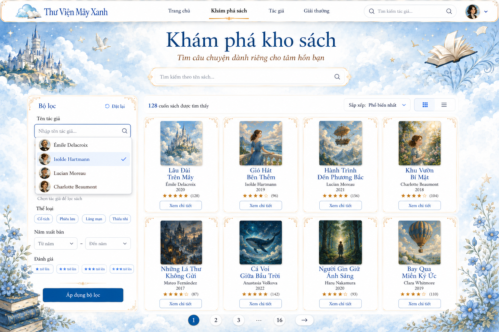
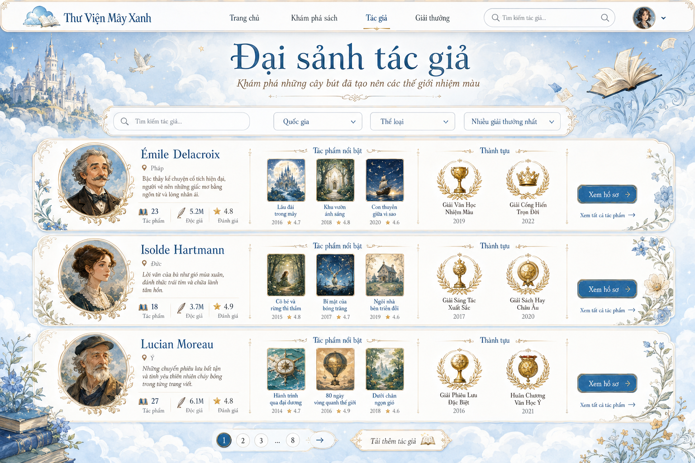

# Chủ đề 1: Sử dụng Join Fetch để giải quyết vấn đề N+1
Tìm hiểu cách JOIN FETCH làm giảm các truy vấn không cần thiết, đồng thời nhận biết những trường hợp nó có thể tạo ra tập dữ liệu quá lớn hoặc làm sai cách phân trang.

## Nội dung trình bày


##  1. Giới thiệu hệ thống
Hệ thống quản lý sách trực tuyến cho phép người dùng tìm kiếm sách và xem thông tin về tác giả, quốc gia, tác phẩm và giải thưởng của họ.



### 1.1. Mô hình dữ liệu
```text
Country (1) ------ (*) Author 
                       Author (1) ------ (*) Book 
                       Author (1) ------ (*) Award
```


### 1.2. Dataset

```text
50 Country
500 Author
20 Book cho mỗi Author -> 10.000 Books
10 Award cho mỗi Author -> 5.000 Awards
```
### 1.3. Các chức năng minh họa

Ba chức năng chính được sử dụng trong bài trình bày:

- **Lọc sách theo tác giả:** Giao diện cần thông tin tên tác giả
- **Đại sảnh tác giả:**
    - Danh sách tác giả và quốc gia: Giao diện cần thông tin tác giả & quốc gia
    - Danh sách tác giả và tác phẩm: Giao diện cần thông tin tác giả & danh sách sách được tác giả viết


## 1.4. Vì sao các association được cấu hình LAZY?

Mỗi chức năng cần một lượng dữ liệu khác nhau, ví dụ:

| Chức năng                         | Dữ liệu cần sử dụng                 |
|-----------------------------------|-------------------------------------|
| Hiển thị bộ lọc tác giả           | `Author.id`, `Author.name`          |
| Hiển thị tác giả và quốc gia      | `Author`, `Country`                 |
| Hiển thị các tác phẩm của tác giả | `Author`, `Book`                    |
| Hiển thị hồ sơ đầy đủ             | `Author`, `Country`, `Book`, `Award` |
| Hiển thị đánh giá của tác giả     | `Author`, `Country`, `Review`       |

Với chức năng **Lọc sách theo tác giả:**


```json
{
  "id": 1,
  "name": "Author 1"
}
```

Không cần tải:
```text
Author.country
Author.books
Author.awards
```
> **LAZY giúp tránh tải dữ liệu không cần thiết*

## 2. Các tình huống xảy ra N+1
## 2.1. Tải danh sách tác giả và quốc gia


Một cách triển khai đơn giản:

| Luồng xử lý                                                                                              |  | SQL phát sinh |  | Kết quả |
|----------------------------------------------------------------------------------------------------------| :---: | --- | :---: | --- |
| Tải danh sách Authors<br><br>↓<br><br>Duyệt qua từng Author<br><br>↓<br><br>Truy cập Country của tác giả | ➜ | 1 query tải toàn bộ Authors<br><br>+<br><br>1 query cho mỗi Country chưa được tải | ➜ | 500 Authors tham chiếu 50 Countries<br><br>**1 + 50 = 51 SQL statements** |
### Kết quả

| Metric               | Value |
| -------------------- |------:|
| ORM queries          |   `1` |
| SQL statements       |  `51` |
| Estimated rows | `550` |

> Mặc dù có 500 Authors, hệ thống chỉ có 50 Countries khác nhau. Sau khi một Country được tải, Hibernate có thể tái sử dụng entity đó trong Persistence Context hiện tại.


## 2.2. Tải danh sách tác giả và sách
- **Đại sảnh tác giả:** cần hiển thị mỗi tác giả cùng danh sách tác phẩm:
  


| Luồng xử lý |  | SQL phát sinh |  | Kết quả |
| --- | :---: | --- | :---: | --- |
| Tải danh sách Authors<br>↓<br>Duyệt qua từng Author<br>↓<br>Truy vấn Books tương ứng | ➜ | 1 query tải toàn bộ Authors<br>↓<br>1 query tải Books cho mỗi Author | ➜ | **1 + 500 = 501 SQL statements** |

### Kết quả

| Metric         |    Value |
| -------------- | -------: |
| ORM queries    |      `1` |
| SQL statements |    `501` |
| Estimated rows | `10.500` |

Số rows = 500 rows Author + 10.000 rows Book.

## 2.3. Tải danh sách tác giả và sách và giải thưởng
- **Đại sảnh tác giả:** cần hiển thị mỗi tác giả cùng danh sách tác phẩm và giải thưởng:
- 

| Luồng xử lý                                                                                                            |  | SQL phát sinh                                                                                                         |  | Kết quả                                  |
|------------------------------------------------------------------------------------------------------------------------| :---: |-----------------------------------------------------------------------------------------------------------------------| :---: |------------------------------------------|
| Tải danh sách Authors<br>↓<br>Duyệt qua từng Author<br>↓<br>Truy vấn Books tương ứng<br>↓<br>Truy vấn Awards tương ứng | ➜ | 1 query tải toàn bộ Authors<br>↓<br>1 query tải Books cho mỗi AuthorAuthors<br>↓<br>1 query tải Awards cho mỗi Author | ➜ | **1 + 500 + 500 = 1.001 SQL statements** |
### Kết quả

| Metric         |    Value |
| -------------- | -------: |
| ORM queries    |      `1` |
| SQL statements |    `1001` |
| Estimated rows | `15500` |

Số rows = 500 rows Author + 10.000 rows Book + 5.000 rows Awards.


> N+1 là vấn đề vì ứng dụng phải thực hiện nhiều truy vấn nhỏ lặp lại thay vì lấy dữ liệu trong một lần, làm tăng số lượt giao tiếp với database, độ trễ mạng, chi phí xử lý SQL và thời gian tổng hợp kết quả.


## 3. Áp dụng Join Fetch
## 3.1. JOIN FETCH quan hệ to-one
Thay vì tải Authors trước và Countries sau, repository yêu cầu tải cả hai trong cùng một query:
```java
@Query("""
    select a
    from Author a
    join fetch a.country
    order by a.id
""")
List<Author> findAllWithCountry();
```

Database trả về dữ liệu có dạng:

| Author   | Country   |
| -------- | --------- |
| Author 1 | Country 1 |
| Author 2 | Country 1 |
| Author 3 | Country 2 |

### Kết quả

| Metric               |   N+1 | JOIN FETCH |
| -------------------- |------:| ---------: |
| SQL statements       |  `51` |        `1` |
| Estimated rows | `550` |      `500` |

Join với Country không làm một Author bị nhân thành nhiều dòng.
> **JOIN FETCH với quan hệ to-one rất an toàn và giải quyết bài vấn đề N+1**

## 3.2. JOIN FETCH một collection
```java
@Query("""
    select distinct a
    from Author a
    join fetch a.books
    order by a.id
""")
List<Author> findAllWithBooks();
```
Database trả về dữ liệu có dạng:

| author_id | author_name | book_id | book_title |
| --------: | ----------- | ------: | ---------- |
|         1 | Author 1    |       1 | Book 1     |
|         1 | Author 1    |       2 | Book 2     |
|         1 | Author 1    |       3 | Book 3     |
|         2 | Author 2    |       4 | Book 4     |

```text
500 Authors × 20 Books
=
10.000 joined rows
```
### Kết quả
| Metric         |      N+1 | JOIN FETCH |
| -------------- | -------: | ---------: |
| SQL statements |    `501` |        `1` |
| Estimated rows | `10.500` |   `10.000` |

> **JOIN FETCH một collection giảm số lần truy cập database, nhưng tạo ra một result set lớn hơn.**

## 3.3. JOIN FETCH to-one với pagination

Để tải Authors cùng Country trong một page, repository có thể sử dụng `JOIN FETCH` cho data query và một `countQuery` riêng:

```java
@Query(
    value = """
        select a
        from Author a
        join fetch a.country
        order by a.id
    """,
    countQuery = """
        select count(a)
        from Author a
    """
)
Page<Author> findPageWithCountry(Pageable pageable);
```
Phép join không làm một Author bị nhân thành nhiều dòng, nên database vẫn có thể giới hạn chính xác 10 Authors.

### Kết quả

| Metric               | LAZY Country | JOIN FETCH Country |
| -------------------- | -----------: | -----------------: |
| Data query           |          `1` |                `1` |
| Count query          |          `1` |                `1` |
| Lazy Country queries |          `D` |                `0` |
| Tổng SQL statements  |      `2 + D` |            **`2`** |
| Data rows của page   |         `10` |               `10` |

> **JOIN FETCH to-one kết hợp tốt với pagination vì phép join không làm tăng số dòng của root entity.**

# 4. Giới hạn của JOIN FETCH
## 4.1 MultipleBagFetchException

Nếu hai collection đều được ánh xạ dưới dạng `List` không có index, Hibernate xem chúng là hai bag.

```java
@OneToMany(fetch = FetchType.LAZY)
private List<Book> reviews;

@OneToMany(fetch = FetchType.LAZY)
private List<Award> awards;
```

Khi fetch cả hai collection:

```java
join fetch a.reviews
join fetch a.awards
```

Hibernate có thể ném lỗi:

```text
org.hibernate.loader.MultipleBagFetchException:
cannot simultaneously fetch multiple bags
```

### Nguyên nhân
Kết quả SQL tạo ra nhiều giá trị lặp lại:

| Book   | Award   |
| ------ | ------- |
| Book 1 | Award 1 |
| Book 1 | Award 2 |
| Book 2 | Award 1 |
| Book 2 | Award 2 |
Một bag không có index và có thể chứa dữ liệu trùng hợp lệ.

Vì vậy, Hibernate không thể xác định chắc chắn:

```text
Giá trị trùng thực sự trong collection
```

hay:

```text
Giá trị trùng được tạo ra bởi phép join
```

### Hướng xử lý

* Đổi một collection sang `Set`
* Sử dụng `@OrderColumn` nếu collection thực sự có thứ tự

> **Sửa MultipleBagFetchException chỉ giúp query có thể chạy; nó không loại bỏ nguy cơ Cartesian product.**


## 4.2. Cartesian product khi fetch nhiều collection

Repository fetch đồng thời Books và Awards:
- 
```java
@Query("""
    select distinct a
    from Author a
    join fetch a.books
    join fetch a.awards
    order by a.id
""")
List<Author> findAllWithBooksAndAwards();
```

Mỗi Book của một Author được kết hợp với mỗi Award của cùng Author:

| Author   | Book   | Award   |
| -------- | ------ | ------- |
| Author 1 | Book 1 | Award 1 |
| Author 1 | Book 1 | Award 2 |
| Author 1 | Book 2 | Award 1 |
| Author 1 | Book 2 | Award 2 |

Với dataset hiện tại:

```text
500 Authors
× 20 Books
× 10 Awards
=
100.000 joined rows
```

Hibernate phải đọc toàn bộ 100.000 dòng để xây dựng lại:

```text
500 Authors
10.000 Books
5.000 Awards
= 15.500 Entities
```
| Approach                   | SQL statements | Estimated rows |
| -------------------------- | -------------: | -------------: |
| N+1 Books và Awards        |        `1.001` |       `15.500` |
| JOIN FETCH Books và Awards |            `1` |      `100.000` |
`JOIN FETCH` giảm số query từ `1.001` xuống `1`, nhưng số dòng database trả về tăng từ `15.500` lên `100.000`.
> **Một query không đồng nghĩa với một query hiệu quả.**

- Query duy nhất này có thể làm tăng:
+ Dữ liệu truyền từ database
+ Thời gian đọc ResultSet
+ Chi phí xử lý và loại bỏ dữ liệu trùng

## 4.3. Pagination với collection
Pagination JOIN FETCH với Collection Books

```request
offset 0
limit 10
```
yêu cầu 10 Authors đầu tiên & Association Books.

Mỗi Author có nhiều dòng trong kết quả SQL:

| author_id | book_id |
| --------: | ------: |
|         1 |       1 |
|         1 |       2 |
|         1 |       3 |
|         2 |       4 |
|         2 |       5 |


Để giữ collection đầy đủ, Hibernate có thể tải toàn bộ dữ liệu trước rồi mới phân trang trong JVM:

```text
Database trả về toàn bộ joined rows
→ Hibernate dựng Authors và Books
→ Loại bỏ Authors trùng lặp
→ Chọn 10 Authors trong memory
```

## Bảng kết luận

| Kiểu tải dữ liệu         | Kết luận                                 |
| ------------------------ |------------------------------------------|
| Quan hệ to-one           | **An toàn và được khuyến nghị**          |
| Một collection to-many   | **Phụ thuộc kích thước — cần benchmark** |
| Nhiều collection to-many | **Cartesian product - không nên**        |
| To-one có pagination     | **An toàn**                              |
| To-many có pagination    | **Cartesian product**                    |

> **Mục tiêu không phải là luôn giảm query xuống còn một, mà là tải đúng dữ liệu với chi phí phù hợp cho từng use case.**
