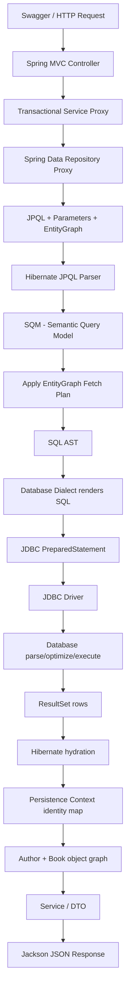

# Từ JPQL đến Database và trở lại Java

Tài liệu này giải thích toàn bộ execution flow của một query trong Spring Data JPA + Hibernate:

```text
HTTP request
    -> Controller
    -> Transactional Service
    -> Spring Data Repository Proxy
    -> JPQL + parameters + EntityGraph
    -> Hibernate SQM
    -> Hibernate SQL AST
    -> SQL + PreparedStatement
    -> JDBC Driver
    -> Database
    -> ResultSet rows
    -> Hibernate hydration
    -> Persistence Context
    -> Entity object graph
    -> DTO/HTTP response
```

Mục tiêu là trả lời rõ:

- Thành phần nào làm việc gì?
- JPQL được chuyển thành SQL ở đâu?
- Database thực sự nhận gì?
- Database trả về gì?
- Hibernate biến rows thành entities như thế nào?
- Vì sao một JPQL có thể tạo nhiều SQL statements?

## 1. Ví dụ xuyên suốt

Swagger endpoint:

```http
GET /api/entity-graph/07-query-plus-graph
```

Controller gọi service:

```java
authorService.demonstrateQueryWithEntityGraph();
```

Service gọi repository:

```java
authorRepository.searchWithQueryAndEntityGraph(
    "George",
    4L
);
```

Repository method:

```java
@EntityGraph("Author.withBooks")
@Query("""
    SELECT a
    FROM Author a
    WHERE LOWER(a.name) LIKE LOWER(CONCAT('%', :keyword, '%'))
       OR a.id > :minId
    ORDER BY a.id
    """)
List<Author> searchWithQueryAndEntityGraph(
    @Param("keyword") String keyword,
    @Param("minId") Long minId
);
```

Query này có hai yêu cầu:

```text
JPQL:
Chọn Author có name chứa "George" hoặc id > 4.

EntityGraph:
Load Books của những Authors được chọn.
```

## 2. Bản đồ tổng thể



Nếu Markdown viewer không render Mermaid, đọc theo flow text ở đầu tài liệu.

## 3. Vai trò của từng thành phần

| Thành phần | Trách nhiệm |
|---|---|
| Tomcat | Nhận HTTP request và chuyển vào Spring MVC |
| Controller | Chọn use case và gọi service |
| Spring Transaction | Mở, commit hoặc rollback transaction |
| Spring Data Repository | Tạo proxy, đọc `@Query`, parameters và `@EntityGraph` |
| JPA/Jakarta Persistence | Định nghĩa API và semantics chuẩn |
| Hibernate | Implement JPA, parse JPQL, tạo query plan/SQL, hydrate entities |
| EntityGraph | Mô tả associations cần fetch |
| Database Dialect | Render SQL phù hợp H2/PostgreSQL/MySQL |
| Hikari/DataSource | Cấp JDBC connection |
| JDBC | API Java để gửi SQL và đọc ResultSet |
| JDBC Driver | Giao tiếp với database cụ thể và chuyển datatype |
| Database | Parse, optimize, execute SQL và trả rows |
| ResultSet | Kết quả phẳng gồm rows và columns |
| Persistence Context | Quản lý entity identity, state, proxies và collections |
| Jackson | Chuyển DTO/response object thành JSON |

## 4. Giai đoạn chuẩn bị khi ứng dụng startup

Trước khi query chạy, Hibernate scan entity mappings:

```java
@Entity
@Table(name = "authors")
public class Author {
    @Id
    private Long id;

    private String name;

    @OneToMany(mappedBy = "author")
    private List<Book> books;
}
```

```java
@Entity
@Table(name = "books")
public class Book {
    @Id
    private Long id;

    @ManyToOne
    @JoinColumn(name = "author_id")
    private Author author;
}
```

Hibernate xây metamodel:

```text
Author              -> table authors
Author.id           -> authors.id
Author.name         -> authors.name
Author.books        -> OneToMany Book

Book                -> table books
Book.author         -> books.author_id
Book.publisher      -> books.publisher_id
```

Hibernate cũng đăng ký Named EntityGraph:

```java
@NamedEntityGraph(
    name = "Author.withBooks",
    attributeNodes = @NamedAttributeNode("books")
)
```

Metadata tương ứng:

```text
Graph name: Author.withBooks
Root type:  Author
Fetch:
└── books
```

Startup phase chỉ chuẩn bị mapping và metadata; business query chưa chạy.

## 5. Bước 1: HTTP request vào Controller

Request:

```http
GET /api/entity-graph/07-query-plus-graph
```

Spring MVC tìm method:

```java
@GetMapping("/07-query-plus-graph")
public DemoResponse queryPlusGraph() {
    authorService.demonstrateQueryWithEntityGraph();
    ...
}
```

Controller không dịch JPQL và không nói chuyện trực tiếp với database. Nó chỉ chuyển request sang service.

## 6. Bước 2: Spring mở transaction

Service:

```java
@Transactional(readOnly = true)
public void demonstrateQueryWithEntityGraph() {
    ...
}
```

Spring tạo transactional proxy. Về ý tưởng:

```java
beginTransaction();

try {
    invokeServiceMethod();
    commitTransaction();
} catch (Exception exception) {
    rollbackTransaction();
    throw exception;
}
```

Spring gắn một `EntityManager` và Persistence Context vào transaction hiện tại.

```text
Persistence Context
├── identity map
├── managed entities
├── persistent collections
├── lazy proxies
└── dirty-checking snapshots
```

`readOnly=true` không có nghĩa không tồn tại transaction. Hibernate vẫn cần Persistence Context để hydrate và quản lý object graph.

## 7. Bước 3: Spring Data Repository Proxy

`AuthorRepository` là interface, không có implementation do project tự viết:

```java
public interface AuthorRepository
        extends JpaRepository<Author, Long> {
}
```

Spring Data tạo repository proxy runtime. Khi method được gọi, proxy đọc:

```text
JPQL từ @Query
EntityGraph từ @EntityGraph
keyword = "George"
minId   = 4
expected result type = List<Author>
```

Spring Data chịu trách nhiệm:

- Nhận repository method call.
- Resolve method parameters.
- Tạo JPA query thông qua EntityManager.
- Đính kèm EntityGraph hint.
- Gọi query execution.
- Chuyển kết quả Hibernate trả về cho service.

Spring Data không phải component chính dịch JPQL thành SQL. Hibernate làm phần đó.

## 8. Bước 4: Hibernate parse JPQL

JPQL:

```jpql
SELECT a
FROM Author a
WHERE LOWER(a.name) LIKE LOWER(CONCAT('%', :keyword, '%'))
   OR a.id > :minId
ORDER BY a.id
```

Database không hiểu chuỗi này vì:

```text
Author  = entity name
a.name  = Java entity attribute
:minId  = named JPQL parameter
```

Hibernate lexer/parser nhận diện:

```text
SELECT
FROM
WHERE
LOWER
LIKE
CONCAT
OR
ORDER BY
```

Sau đó resolve:

```text
Root entity: Author
Alias:       a
Selection:   Author entity
Predicate 1: LOWER(a.name) LIKE ...
Predicate 2: a.id > :minId
Ordering:    a.id ASC
```

Nếu viết field không tồn tại:

```jpql
WHERE a.fullName = :name
```

Hibernate có thể báo lỗi trước khi database nhận SQL, vì metamodel không có `Author.fullName`.

## 9. Bước 5: Hibernate tạo SQM

Hibernate 6 chuyển JPQL thành SQM — Semantic Query Model.

Có thể hình dung:

```text
SqmSelectStatement
├── Root: Author a
├── Selection: a
├── Predicate: OR
│   ├── LOWER(a.name) LIKE LOWER(CONCAT(...))
│   └── a.id > :minId
└── OrderBy: a.id ASC
```

SQM không chỉ biết syntax; nó đã hiểu semantics:

```text
Author là entity type nào.
name có type String.
id và minId có type Long.
Kết quả phải là Author.
```

SQM vẫn ở entity/domain model, chưa phải SQL gửi xuống database.

## 10. Bước 6: Áp dụng EntityGraph

Spring Data đính kèm:

```text
Author.withBooks
```

Hibernate kết hợp:

```text
JPQL:
Chọn Authors nào.

EntityGraph:
Fetch Books cho Authors đó.
```

Vì Spring Data `@EntityGraph` mặc định dùng FETCH graph:

```text
Books   nằm trong graph  -> fetch
Country ngoài graph      -> xem như LAZY cho operation này
```

JPQL không có `JOIN FETCH`, nhưng EntityGraph vẫn có thể làm Hibernate thêm Books join vào SQL execution plan.

EntityGraph định nghĩa dữ liệu cần load, không cam kết:

- Chính xác bao nhiêu SQL statements.
- Chính xác bao nhiêu JOIN clauses.
- Association nào dùng join hay secondary select.

## 11. Bước 7: SQM chuyển thành SQL AST

Hibernate dùng mapping để chuyển domain model sang relational model:

```text
Author         -> authors
Author.id      -> authors.id
Author.name    -> authors.name
Author.books   -> books
Book.author    -> books.author_id
```

SQL AST gần giống:

```text
SelectStatement
├── From: authors a
├── LeftJoin: books b
│   └── b.author_id = a.id
├── Predicate: OR
│   ├── LOWER(a.name) LIKE LOWER(CONCAT(...))
│   └── a.id > parameter
├── OrderBy: a.id
└── Selections
    ├── Author columns
    └── Book columns
```

SQL AST là Java object tree nội bộ Hibernate. Database không nhận SQL AST.

## 12. Bước 8: Dialect render SQL

Project dùng H2:

```yaml
spring:
  jpa:
    database-platform: org.hibernate.dialect.H2Dialect
```

Dialect render SQL AST thành SQL phù hợp H2. SQL rút gọn:

```sql
SELECT
    a.id,
    a.name,
    b.author_id,
    b.id,
    b.publish_year,
    b.publisher_id,
    b.title
FROM authors a
LEFT JOIN books b
    ON b.author_id = a.id
WHERE LOWER(a.name) LIKE LOWER(CONCAT('%', ?, '%'))
   OR a.id > ?
ORDER BY a.id;
```

Alias thực tế có thể là:

```text
a1_0
b1_0
```

Nếu chuyển database, logical query không đổi nhưng dialect có thể thay:

- Pagination syntax.
- String concatenation.
- Date/time functions.
- Boolean literals.
- JSON functions.
- Locking syntax.

Dialect chỉ render SQL; nó không execute SQL.

## 13. Bước 9: Tạo PreparedStatement và bind parameters

Hibernate không nối trực tiếp input vào SQL. Nó dùng placeholders:

```sql
WHERE LOWER(a.name) LIKE LOWER(CONCAT('%', ?, '%'))
   OR a.id > ?
```

Sau đó bind:

```text
parameter 1: VARCHAR <- "George"
parameter 2: BIGINT  <- 4
```

Về ý tưởng:

```java
PreparedStatement statement = connection.prepareStatement(sql);
statement.setString(1, "George");
statement.setLong(2, 4L);
```

PreparedStatement:

- Tránh SQL injection qua parameter values.
- Giữ đúng datatype.
- Không cần developer tự escape chuỗi.
- Cho phép database/driver tái sử dụng plan trong một số trường hợp.

Project log riêng:

```text
org.hibernate.SQL
→ SQL chứa dấu ?

org.hibernate.orm.jdbc.bind
→ giá trị bind vào từng ?
```

## 14. Bước 10: Lấy JDBC Connection

Flow:

```text
Hibernate
    -> DataSource/HikariCP
    -> JDBC Connection
    -> PreparedStatement
```

Hibernate gọi:

```java
statement.executeQuery();
```

JDBC là API chuẩn Java. JDBC Driver mới biết cách giao tiếp với database cụ thể:

```text
H2 JDBC Driver
PostgreSQL JDBC Driver
MySQL JDBC Driver
```

H2 trong project chạy in-memory, nhưng application vẫn dùng JDBC API.

## 15. Bước 11: Database nhận gì?

Database chỉ nhận:

```text
SQL string
+ bound parameter values
```

Database không nhận:

- JPQL.
- HQL.
- EntityGraph.
- Java `Author` class.
- `List<Book>`.
- Persistence Context.
- DTO.

Database biết:

```text
tables
columns
indexes
constraints
SQL
```

## 16. Bước 12: Database parse, optimize và execute

Database thực hiện:

### Parse

Kiểm tra SQL grammar.

### Resolve

Kiểm tra:

```text
authors và books có tồn tại không?
id, name, author_id có tồn tại không?
Datatypes có hợp lệ không?
```

### Optimize

Optimizer chọn physical execution plan:

```text
Scan table nào trước?
Có dùng index không?
Dùng nested-loop/hash/merge join?
Filter lúc nào?
Sort bằng cách nào?
```

SQL giống nhau không tuyệt đối bảo đảm physical plan giống nhau khi dữ liệu/index/statistics thay đổi.

### Execute

Database đọc rows, join, filter và sort.

## 17. Bước 13: Database trả ResultSet rows

Với:

```text
keyword = George
minId   = 4
```

Authors được chọn:

```text
ID 3: George R.R. Martin
ID 4: George Orwell
ID 5: Alexandre Dumas vì id > 4
```

Mỗi Author có ba Books nên database trả chín joined rows:

| Author ID | Author | Book ID | Book |
|---:|---|---:|---|
| 3 | George R.R. Martin | 7 | A Game of Thrones |
| 3 | George R.R. Martin | 8 | A Clash of Kings |
| 3 | George R.R. Martin | 9 | A Storm of Swords |
| 4 | George Orwell | 10 | Animal Farm |
| 4 | George Orwell | 11 | Nineteen Eighty-Four |
| 4 | George Orwell | 12 | Homage to Catalonia |
| 5 | Alexandre Dumas | 13 | The Three Musketeers |
| 5 | Alexandre Dumas | 14 | The Count of Monte Cristo |
| 5 | Alexandre Dumas | 15 | Twenty Years After |

Database không trả `List<Author>` và không trả object graph. Nó trả rows/columns phẳng qua JDBC ResultSet.

## 18. Bước 14: JDBC Driver chuyển database values

JDBC Driver expose:

```java
ResultSet resultSet;
```

Hibernate đọc:

```java
resultSet.next();
resultSet.getLong(...);
resultSet.getString(...);
```

Driver chuyển types:

```text
BIGINT  -> Long
INTEGER -> Integer
VARCHAR -> String
```

JDBC Driver không tạo Author hoặc Book entities. Hibernate làm hydration.

## 19. Bước 15: Hibernate hydration

Hydration là:

> Chuyển rows/columns phẳng thành entities và object graph.

### Row đầu: A3-B7

Hibernate kiểm tra Persistence Context:

```text
(Author, 3) đã tồn tại chưa?
```

Chưa có, Hibernate tạo Author 3 và đăng ký:

```text
(Author, 3) -> Author object A3
```

Hibernate tạo Book 7:

```text
(Book, 7) -> Book object B7
```

Sau đó thêm B7 vào Books collection của A3.

### Row thứ hai: A3-B8

Hibernate thấy `(Author, 3)` đã tồn tại nên dùng lại cùng object A3. Nó chỉ tạo B8 rồi thêm vào A3.books.

### Row thứ ba: A3-B9

Tiếp tục reuse A3, tạo B9 và thêm vào collection.

Quá trình lặp lại với Authors 4 và 5.

Kết quả:

```text
9 SQL rows
    -> 3 Author objects
    -> 9 Book objects
    -> 3 initialized Books collections
```

Metrics:

```text
JDBC statements:      1
entities loaded:      12
collections loaded:   3
collections fetched:  0
```

```text
3 Authors + 9 Books = 12 entities
```

Books được load từ root joined query nên không có collection fetch SQL riêng.

## 20. Bước 16: Persistence Context quản lý object identity

Persistence Context giữ identity map:

```text
(Author, 3) -> A3
(Author, 4) -> A4
(Author, 5) -> A5
(Book, 7)   -> B7
...
```

Nếu nhiều rows cùng có Author ID 3, Hibernate không tạo nhiều Author objects:

```java
authorFromRow1 == authorFromRow2
```

Persistence Context còn quản lý:

- Managed/detached state.
- Lazy proxies.
- Persistent collections.
- Dirty-checking snapshots.
- First-level cache.

`entities loaded` đếm entity instances được hydrate, không đếm SQL rows.

## 21. Bước 17: Repository trả object graph

Hibernate trả:

```java
List<Author>
```

Spring Data repository proxy trả list đó cho service:

```text
List size = 3

Author 3 -> 3 Books
Author 4 -> 3 Books
Author 5 -> 3 Books
```

Khi service gọi:

```java
author.getBooks().size();
```

không có SQL mới vì EntityGraph đã initialize Books.

Nếu Books không được fetch, truy cập này có thể trigger:

```sql
SELECT *
FROM books
WHERE author_id = ?;
```

Đó là cách lazy navigation tạo thêm SQL sau root query.

## 22. Bước 18: Transaction kết thúc và tạo response

Sau khi service hoàn tất, Spring kết thúc transaction.

Project cấu hình:

```yaml
spring:
  jpa:
    open-in-view: false
```

Vì OSIV tắt, Persistence Context không được giữ mở đến cuối JSON serialization. Nếu controller trả entity có association LAZY chưa initialized, Jackson truy cập association sau transaction có thể gây:

```text
LazyInitializationException
```

Runtime endpoint vì vậy map entity sang DTO bên trong transaction:

```text
Managed Author
    -> map while Persistence Context is open
AuthorDetailResponse
    -> Controller
    -> Jackson JSON
```

Jackson tạo JSON. Database không tạo JSON.

## 23. JPQL, HQL, SQL và Native SQL khác nhau ở đâu?

```text
JPQL:
Query theo entity và Java attributes.

HQL:
Ngôn ngữ query entity của Hibernate; hỗ trợ JPQL và extensions.

SQL:
Query theo tables và columns; database thực thi.

Native SQL:
Developer tự viết SQL; Hibernate không dịch entity names thành table names.
```

Ví dụ:

```jpql
SELECT a FROM Author a WHERE a.id > :minId
```

Hibernate dịch thành:

```sql
SELECT a.*
FROM authors a
WHERE a.id > ?;
```

## 24. Derived query đi qua flow nào?

Repository:

```java
List<Author> findByNameContainingIgnoreCaseOrderById(String name);
```

Không có JPQL string do developer viết. Spring Data parse method name và xây query model tương đương:

```jpql
SELECT a
FROM Author a
WHERE LOWER(a.name) LIKE LOWER(:name)
ORDER BY a.id
```

Sau đó query vẫn đi qua Hibernate mapping, SQL AST, dialect, JDBC, database và hydration.

## 25. `findById()` đi qua flow nào?

`findById()` có thể dùng entity-by-id loading API thay vì JPQL text. Hibernate vẫn:

- Đọc entity mapping.
- Áp dụng EntityGraph nếu có.
- Tạo SQL AST/load plan.
- Render SQL.
- Gọi JDBC.
- Hydrate entity.

Không nhìn thấy JPQL trong source không có nghĩa Hibernate không cần tạo SQL execution plan.

## 26. Native query bỏ qua bước nào?

```java
@Query(
    value = "SELECT * FROM authors WHERE id > :minId",
    nativeQuery = true
)
```

Developer đã viết SQL nên Hibernate không cần dịch:

```text
Author -> authors
Author.name -> authors.name
```

Nhưng Hibernate vẫn:

- Bind parameters.
- Lấy connection.
- Gọi JDBC.
- Đọc ResultSet.
- Map rows về entity/DTO.
- Quản lý entities trong Persistence Context nếu result là entity.

## 27. Vì sao một JPQL có thể tạo nhiều SQL?

Không có quy tắc:

```text
1 JPQL = 1 SQL
```

Các nguyên nhân tạo SQL bổ sung:

### Lazy collection

```text
1 root query
+ N collection queries
```

### EAGER secondary selects

```text
1 root query
+ queries load EAGER ToOne associations
```

### Spring Data `Page`

```text
1 content query
+ 1 count query
```

### Runtime EntityGraph

Hibernate có thể dùng:

```text
root query
+ secondary collection select
+ nested entity select
```

### Batch fetching

```text
root query
+ one or more WHERE id IN (...) queries
```

EntityGraph định nghĩa WHAT cần load. Hibernate quyết định HOW bằng một hoặc nhiều SQL statements.

## 28. PreparedStatement có phải “raw SQL” không?

Hibernate cuối cùng tạo SQL database hiểu, nhưng thường dưới dạng prepared SQL:

```sql
SELECT ...
WHERE name LIKE ?
  AND id > ?;
```

Parameter values được gửi riêng. Không nên hình dung Hibernate luôn ghép thành:

```sql
WHERE name LIKE '%George%' AND id > 4
```

Trong giao tiếp thông thường, “Hibernate chuyển JPQL thành raw SQL” có nghĩa là nó chuyển sang database SQL, không có nghĩa parameter values luôn được nối trực tiếp vào chuỗi.

## 29. Cách đọc log theo đúng flow

### 1. Tìm SQL

```text
org.hibernate.SQL
```

Kiểm tra:

- Root table.
- JOINs.
- WHERE.
- ORDER BY.
- LIMIT/OFFSET.
- Secondary selects.

### 2. Tìm parameter binding

```text
org.hibernate.orm.jdbc.bind
```

Kiểm tra từng `?` nhận giá trị/type nào.

### 3. Đọc metrics

```text
JDBC statements
entities loaded
collections loaded
collections fetched
```

### 4. Đối chiếu code access

Tìm:

```java
getBooks()
getPublisher()
getCountry()
```

Một getter trên LAZY association có thể là điểm phát sinh SQL tiếp theo.

## 30. Checklist khi thấy query bất ngờ

1. Repository dùng JPQL, derived query, `findById` hay native query?
2. Có `@EntityGraph` hoặc `JOIN FETCH` không?
3. Graph là `FETCH` hay `LOAD`?
4. Association ngoài graph có mapping EAGER không?
5. Service có truy cập LAZY association trong vòng lặp không?
6. Persistence Context có được clear trước metric không?
7. Query có trả `Page` nên sinh count query không?
8. Có collection fetch + pagination không?
9. Có nhiều ToMany làm nhân rows không?
10. SQL statements nhiều vì N+1 hay vì intentional secondary fetching?

## 31. Mental model ngắn gọn

```text
Bạn viết:
JPQL theo entity model.

Spring Data:
Đọc repository method, parameters và EntityGraph.

Hibernate:
Parse JPQL
→ SQM
→ áp dụng graph
→ SQL AST
→ SQL.

JDBC:
Gửi prepared SQL và parameters.

Database:
Parse
→ optimize
→ execute
→ trả rows.

Hibernate:
Đọc rows
→ hydrate entities
→ reuse entity theo ID
→ initialize collections.

Service:
Dùng object graph hoặc map DTO.

Jackson:
Tạo JSON response.
```

## 32. Câu kết luận

```text
Database không hiểu JPQL và không trả entity objects.
Hibernate là cầu nối giữa entity model và relational database.
JPQL mô tả query theo domain model.
EntityGraph mô tả associations cần fetch.
Hibernate tạo execution plan và SQL.
JDBC vận chuyển SQL/ResultSet.
Database trả rows phẳng.
Hibernate hydrate rows thành object graph trong Persistence Context.
```
